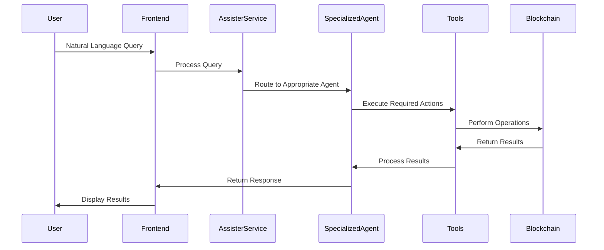

# 🤖 SolMate : Your Reliable AI Companion in your Defi Journey on Solana

> A Dapp Where Multiple specialized autonomous AI agents with powerful tools work together to analyze, recommend, and execute optimal DeFi strategies while maintaining user-defined risk parameters and portfolio goals powered by Solana Agent Kit & Langchain.

## 🎯 Problem Statement
Managing DeFi portfolios across multiple protocols on Solana can be complex and time-consuming. 

Users need to:
- Monitor multiple positions across Solana DeFi protocols
- Execute complex multi-step transactions
- Stay updated with the latest yield opportunities
- Maintain desired portfolio allocations
- React quickly to market changes

## 💡 Solution
An autonomous AI agent system that manages your Solana DeFi portfolio by:
- Understanding high-level goals in natural language
- Breaking down complex operations into executable steps
- Automatically executing transactions when needed
- Providing real-time updates and progress tracking
- Maintaining portfolio balance according to user preferences

## 🏗 Architecture


## 🌟 Key Features

### 1. Natural Language Interface
- Express portfolio goals in plain English
- No need to understand complex DeFi terminology
- AI translates intentions into actions

### 2. Autonomous Execution
- Breaks down complex goals into steps
- Executes transactions automatically
- Handles error recovery
- Provides progress updates

### 3. Portfolio Management
- Multi-protocol position monitoring
- Yield optimization
- Risk management
- Rebalancing capabilities

### 4. Real-time Updates
- Live execution status
- Progress tracking
- Transaction confirmations
- Performance metrics


### Benefits

- **Decentralized Validation**: Multiple operators validate portfolio decisions
- **Transparent History**: All validations and updates are publicly trackable
- **Real-time Analytics**: Quick access to historical validation data
- **Scalable Architecture**: Handles multiple portfolios and validation strategies
- **Secure Operations**: Cryptographic verification of operator responses

## 🛠 Technology Stack
- **Frontend**: Next.js, TypeScript, TailwindCSS
- **AI Engine**: Brian AI, LangChain, GPT-4
- **Blockchain**: Avalanche C-Chain, Teleporter, Eigenlayer AVS
- **Development**: Foundry, Avalanche CLI
- **Indexing**: The Graph Protocol

## 📋 Example Use Cases

I'll update the Example Use Cases section in the README.md based on the example scenarios from page.tsx:

```markdown
## 📋 Example Use Cases

### 1. Portfolio Optimization
```text
User: "I have 100 SOL and want to optimize my yield across Solana DeFi protocols. What's the best strategy?"

Agent Collaboration Flow:
1. Portfolio Manager analyzes request
2. DeFi Analytics Agent provides data:
   - Marinade Finance stSOL APY: 6.8%
   - Solend USDC lending APY: 12.4%
   - Orca ORCA-SOL pool APR: 24.5%
   - Raydium RAY-SOL pool APR: 28.2%
3. Staking Agent suggests liquid staking via Marinade
4. Lending Agent analyzes Solend opportunities
5. Liquidity Agent evaluates Orca pools

Final Recommendation:
- 40 SOL → Marinade Finance (stSOL)
- Use stSOL as collateral on Solend
- 30 SOL → Orca stSOL-SOL concentrated liquidity pool
- 30 SOL → Split between Raydium RAY-SOL and ORCA-SOL pools
```

### 2. Arbitrage Opportunities
```text
User: "Find the best arbitrage opportunities between Jupiter and Orca for SOL-USDC pairs"

Agent Collaboration Flow:
1. Trading Agent analyzes price disparities
2. DeFi Analytics provides market data:
   - Jupiter best SOL/USDC: $101.25
   - Orca SOL/USDC CL pool: $101.45
   - 24h volume: $24.5M
   - Liquidity depth: 45,000 SOL
3. Research Agent analyzes historical spreads
4. Portfolio Manager recommends execution strategy

Opportunity Detected:
- Buy 10 SOL on Jupiter at $101.25
- Sell on Orca CL pool at $101.45
- Potential profit: 0.2% (minus fees)
```

### 3. Safe Yield Strategy
```text
User: "What's the safest way to earn yield on 1000 USDC on Solana?"

Agent Collaboration Flow:
1. Portfolio Manager prioritizes security
2. DeFi Analytics provides stable yields:
   - Solend Main Pool USDC: 5.8% APY
   - Mango Markets USDC: 6.2% APY
   - UXD Protocol USDC: 4.9% APY
3. Lending Agent analyzes protocol security
4. Research Agent provides risk scores

Recommendation:
- 700 USDC to Solend Main Pool (5.8% APY)
- 300 USDC to Mango Markets (6.2% APY)
- Estimated blended APY: 5.9%
- Risk Level: Low
```
## ⭐ Key Features

### 🧠 Intelligent Portfolio Management
- Natural language interaction
- Autonomous strategy execution
- Real-time portfolio analysis
- Risk-aware decision making
- Multi-protocol optimization

### 💼 Portfolio Operations
- Token swaps
- Liquidity provision
- Yield farming
- Risk rebalancing
- Position management

### 📊 Monitoring & Feedback
- Real-time execution status
- Progress tracking
- Transaction confirmations
- Performance metrics
- Risk alerts


## 💡 Example Use Cases

### 1. Yield Optimization
```plaintext
User: "Optimize my portfolio for maximum yield while maintaining 30% in stablecoins"

Agent will:
1. Analyze current holdings
2. Identify highest yield opportunities
3. Calculate optimal allocations
4. Execute required swaps
5. Deploy capital to yield protocols
6. Maintain stability ratio
```

### 2. Risk Management
```plaintext
User: "Reduce portfolio risk and move to defensive positions"

Agent will:
1. Evaluate current risk metrics
2. Identify high-risk positions
3. Plan exit strategies
4. Execute position closures
5. Reallocate to stable assets
6. Confirm risk reduction
```

### 3. Market Opportunity
```plaintext
User: "Take advantage of SOL price dip with 20% of portfolio"

Agent will:
1. Check current AVAX price
2. Calculate optimal entry points
3. Identify assets to swap
4. Execute Defi Actions

```

## 🤖 Agent Architecture

### Assister Integration
The platform leverages the Assister service for enhanced agent capabilities:

```typescript
// Agent Communication Layer
interface AssisterResponse {
    message: string;
    message_at: string;
    is_user: boolean;
}

// Core Agent Services
- Session Management
- Real-time Chat Processing
- Context-Aware Responses
```

### Specialized Agents

1. **Trading Agent**
   - Perp trading execution
   - Take profit/Stop loss management
   - Position sizing optimization
   - Protocols: Jupiter, Mango Markets

2. **Research Agent**
   - Market analysis
   - Protocol research
   - Risk assessment
   - Data Sources: DeFi Llama, Token Terminal

3. **Liquidity Management Agent**
   - Launch tokens
   - Manage liquidity pools
   - Stake-to-earn strategies
   - Protocols: Orca, Raydium

4. **Portfolio Manager**
   - Portfolio optimization
   - Risk management
   - Asset allocation
   - Cross-protocol management

5. **DeFi Analytics Agent**
   - TVL tracking
   - Yield analysis
   - Protocol comparison
   - Powered by DeFi Llama data

6. **Lending Agent**
   - Lend assets
   - Monitor positions
   - Auto-rebalance
   - Protocols: Meteora, Solend

7. **Staking Agent**
   - Stake SOL
   - Monitor rewards
   - Auto-compound
   - Protocols: Marinade, Lido

8. **Solana Assistant**
   - Chain analysis
   - Transaction help
   - Protocol guidance
   - General Solana support

### Agent Tools & Capabilities

```typescript
// Core Tools
- Coingecko Price Data
- DeFi Llama Analytics
- Solana Network Tools
- Trading Execution
- Yield Analysis
```

### Communication Flow



## 🛠️ Built With

- **Frontend**: Next.js, TypeScript, TailwindCSS
- **AI/ML**: Brian AI, LangChain, GPT-4
- **Blockchain**: Avalanche Network, TraderJoe DEX
- **Development**: Node.js, Ethers.js

## 📋 Prerequisites

```bash
# Required environment variables
NEXT_PUBLIC_BRIAN_API_KEY=your_brian_api_key
NEXT_PUBLIC_PRIVATE_KEY=your_private_key
NEXT_PUBLIC_OPENAI_API_KEY=your_openai_api_key
```
